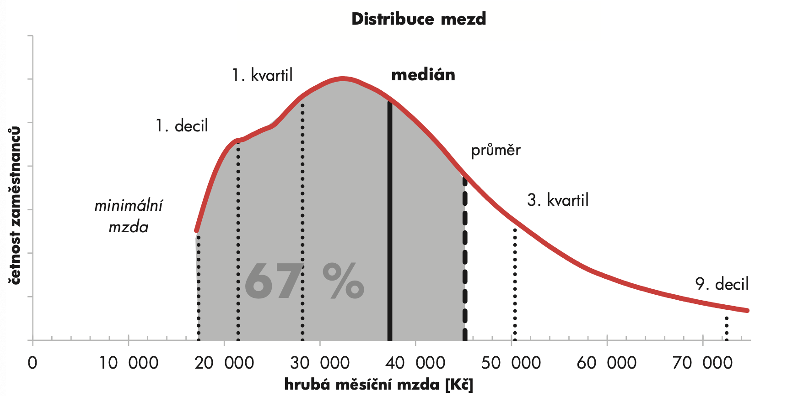
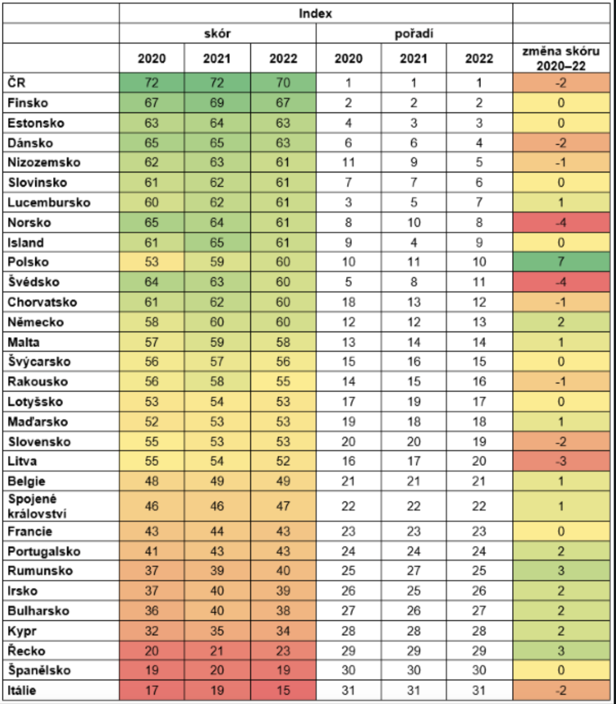
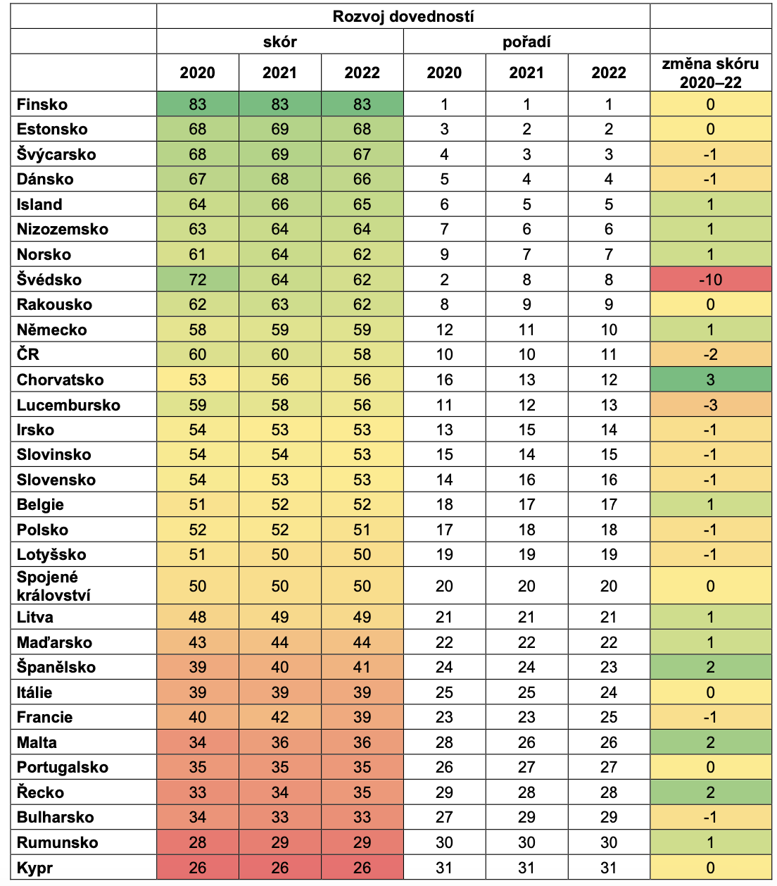

# ESI a ISPV

## ISPV

Podle výsledků za 2. čtvrtletí roku 2023:

- Muži měli vyšší průměrnou měsíční odpracovanou dobu (150,7 h) - ženy 147,4
- Medián hrubé měsíční mzdy: 37.308/měs
- Průměr hrubé měsíční mzdy: 45.136/měs
  - Růst oproti minulému roku: 7.5%
- Průměrná placená doba: 172,3/měs

Decil 10%
Kvartil 25%

- Lidé mezi lety 30-39 mají největší medián, a to: 40.100
- Muži mají vyšší medián skoro o 7.000!

## ESI

- Česká Republika si stojí dlouhodobě na 1. příčkách
- Však poslední dobou si ČR poklesla o 2 body

- Vidíme že zemi jižanské geografické oblasti maji neinižšší skór.
- Ve vysokém skoru ČR pomáhá hlavně vysoký podíl osob, které dosahují středního vzdělání
- V rozvoji dovedností si ČR nevede nejlépe

- A opět země s jižní geografickou lokací si nevedou nejlépe, kde naopak země se severní geografickou lokací mají lepší skór
- Výpovědní hodnotou je následný rozvoj dovedností v průběhu života; respektive po vzdělání

- Výsledkem ekonomické stagnace a lehkého poklesu zemí jako: Španělska Itálie, Řekcka může být nízké ESI;  v dnešní době je dominantou právě Informační gramotnost
