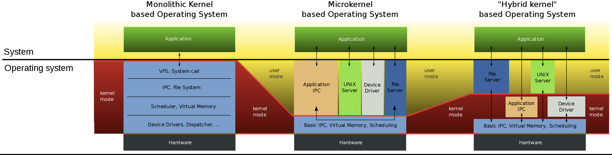

# Kernel

- Monolitické
- Mikro/Nano
- Hybridní
- EXO

## Monolitické

- Tradiční struktura OS
- Jeden program obsahuje celý kód jádra a poskytuje všechny služby OS
- Systémová volání
- Rychlé a efektivní
- Méně přenositelné a těžké na údržbu
- Malé chyby dokáži shodit celý systém
- Unix a podobné OS

## Mikro

- Minimální jádro
- Zjednodušený návrh jádra - pouze privilegovaný režim
- Delegace části jádra na (deamons, servers) - moduly
  - Režie pro komunikace - **IPC**

- User-space servery
- Rychlé nasazení, jednoduchá údržba
- Větší paměťová stopa
- Časté přepínání kontextu

## Hybridní řešení

- Snaha o jádro co nejmenší, však má i důležité komponenty
- Moderní komerční OS
