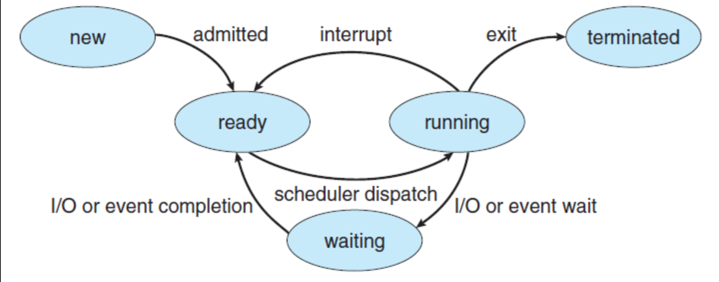
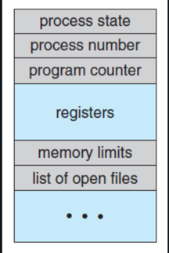

# Procesy

## New 

- Proces je vytvořen s PCB

- Jsou inicializovány registry, zásobník, ...

## Ready

- Proces je zařazen na konec fronty **FIFO**
- Pomocí dispatcheru je nahrán do procesoru (výměna všech registrů; PCB)

